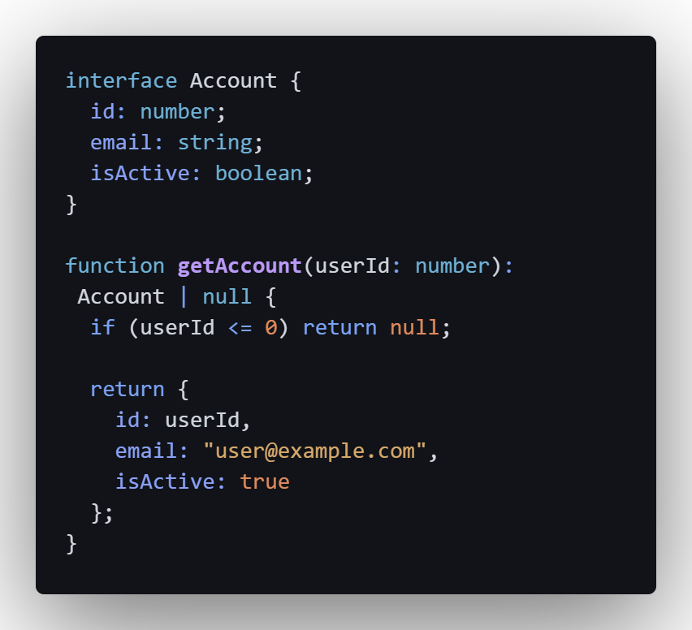
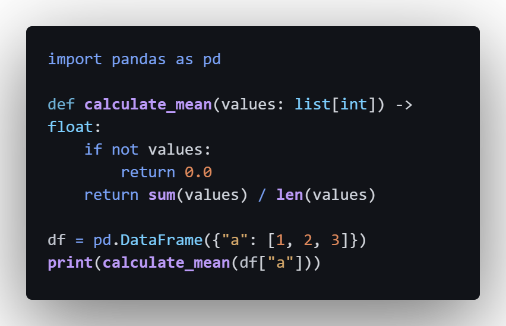
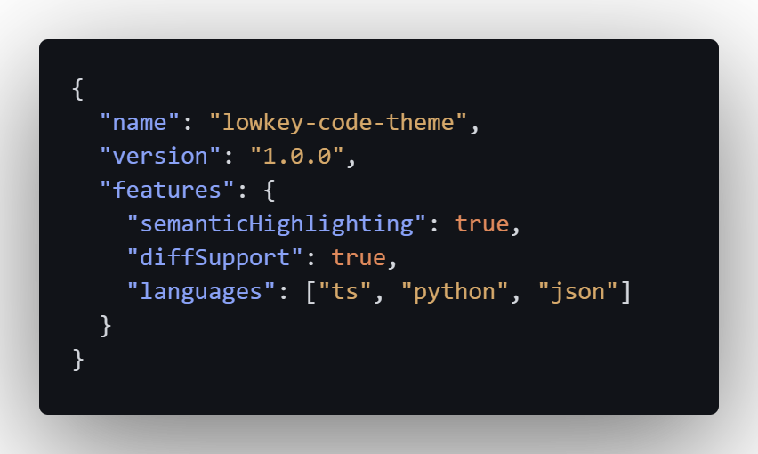
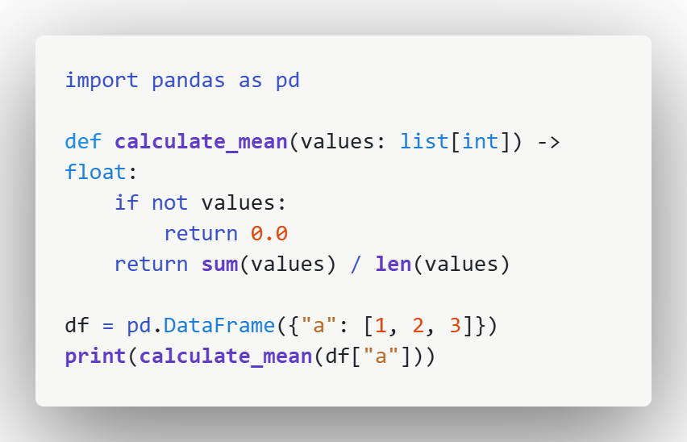
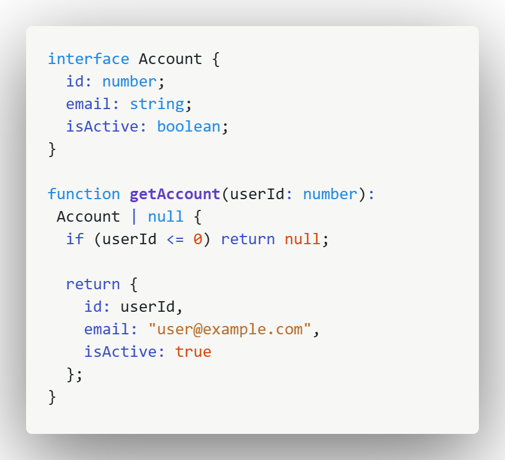
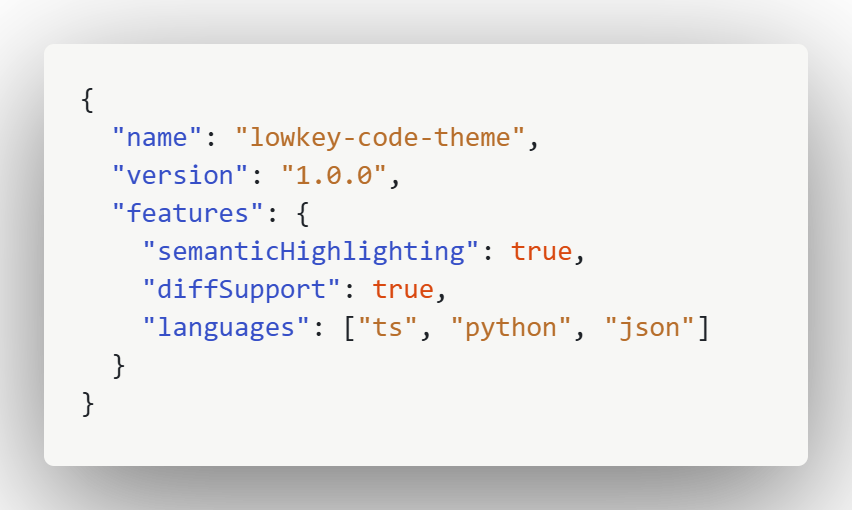

# Lowkey Code Theme

A calm, distraction-free VS Code theme designed for long coding sessions.

## Preview

  
  
  

  
  
  

## Features

- Clean, readable syntax highlighting
- Calm contrast for long coding sessions
- Dark and light variants
- Thoughtful diff colors for real-world use

## Installation

### From the VS Code Marketplace
Search for **Lowkey Code Theme** in Extensions.

### Manual
Clone this repository and load it as a local VS Code extension for development.

## Themes included

- Lowkey Code Light
- Lowkey Code Dark

## License

MIT